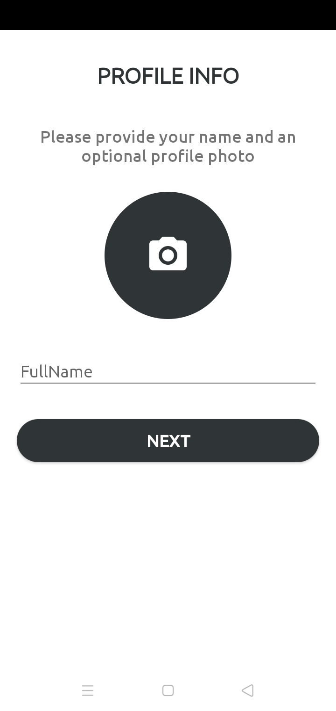

# Screenshots

<table>
       <tr>
          <td></td>
          <td></td>
          <td></td>
        </tr><tr>
           <td></td>
           <td></td>
           <td></td>
        </tr>
         <tr>
             <td></td>
             <td></td>
             <td></td>
         </tr>
</table>

### Libraries used

<ul>
<li>Firebase Email Authentication</li>
<li>Firestore</li>
<li>Glide</li>
</ul>

## App Demo

